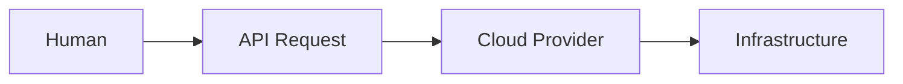
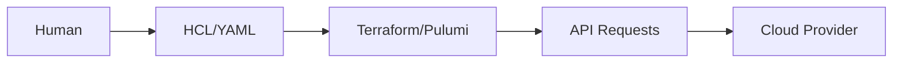
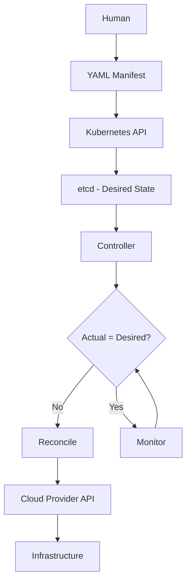
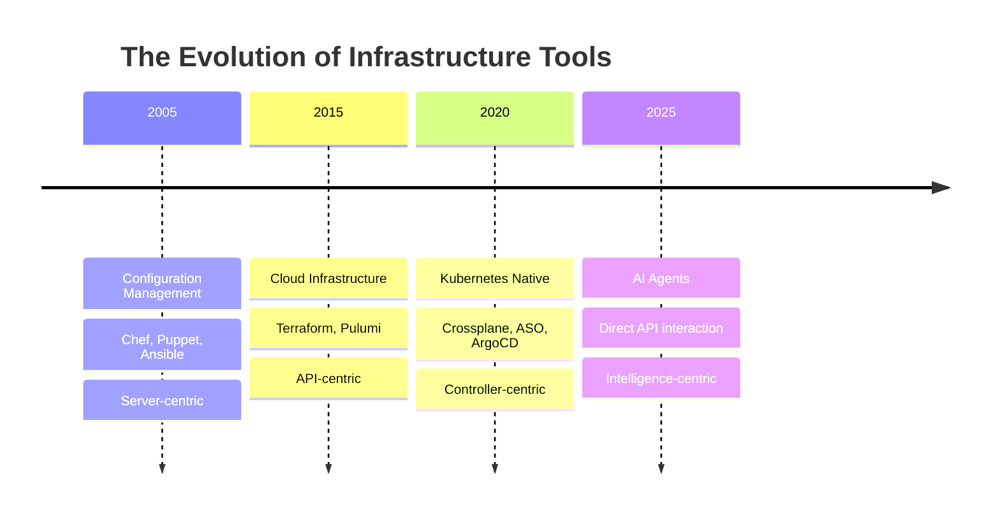
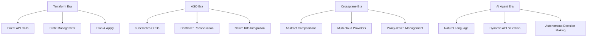
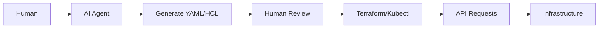
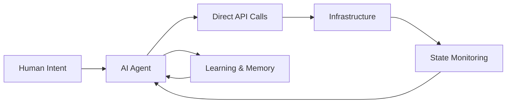
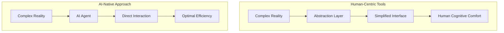
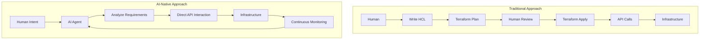

# The Death of Infrastructure-as-Code: Why AI Will Kill Terraform, Pulumi, and Everything Else

Here's a prediction that might shock you: every Infrastructure-as-Code tool you're using today—Terraform, Pulumi, Crossplane—will be obsolete within the next few years. The killer? AI agents that don't need the human-centric abstractions we've built our entire industry around.

This isn't just speculation. It's a pattern we've seen before, and it's about to happen again.

## The Foundation: Everything is an API

Before we dive into why your favorite IaC tools are doomed, let's establish the foundation. Every cloud provider—AWS, Azure, Google Cloud, UpCloud, Linode—offers their services through HTTP APIs. Even on-premises solutions like vSphere and Kubernetes expose everything through APIs.

This is the bedrock truth: **everything you manage is accessible via API**.



The question isn't whether APIs exist—they do. The question is how we interact with them.

## Generation 1: The Human Problem

Here's why nobody interacts directly with APIs using curl:

```bash
# Nobody wants to write this
curl -L "https://iam.amazonaws.com/?Action=ListUsers&Version=2010-05-08" \
    --aws-sigv4 "aws:amz:us-east-1:iam" \
    --user "${AWS_ACCESS_KEY_ID}:${AWS_ACCESS_KEY}"
```

Instead, we prefer this:

```bash
# Much easier for humans
kubectl get namespaces
```

**Why?** Because humans are terrible at handling complexity. We get overwhelmed by intricate JSON payloads. We make mistakes with complex API calls. We need cognitive shortcuts and readable formats.

This is where Terraform, Pulumi, and other Infrastructure-as-Code tools come in. Their primary function is simple: **transform human-friendly formats into API requests**.



These tools exist because **humans are bad at complexity**. We need simplification. We need abstractions that reduce mental load.

## Generation 2: The Kubernetes Revolution

Kubernetes introduced something revolutionary: **continuous drift detection and reconciliation**. Instead of executing operations immediately, Kubernetes stores desired state and lets controllers figure out what to do and when to do it.



This is where we start to see **AI-like behavior**. Controllers continuously monitor and adapt, ensuring the actual state matches the desired state forever.

Modern Kubernetes operators go even further—they interact with external APIs, managing databases in Azure, Lambda functions in AWS, and entire fleets of clusters.

## The Pattern of Tool Death

Here's what nobody talks about: **every generation of infrastructure tools has died when the industry shifted**. The pattern is always the same.

### Generation 1: Configuration Management Era
- **Tools**: Chef, Puppet, Ansible
- **Paradigm**: Managing persistent servers
- **Death**: Cloud happened, needed dynamic infrastructure
- **Outcome**: Tools tried to adapt with cloud modules but failed

### Generation 2: Cloud Infrastructure Era
- **Tools**: Terraform, Pulumi, CloudFormation
- **Paradigm**: Immutable cloud infrastructure
- **Current Challenge**: Kubernetes-native workflows
- **Status**: Struggling to adapt to controller-driven reconciliation

### Generation 3: Kubernetes-Native Era
- **Tools**: Crossplane, ArgoCD, Flux, ASO (Azure Service Operator)
- **Paradigm**: Everything as CRDs, GitOps workflows
- **Coming Challenge**: AI agents
- **Prediction**: Will likely fail to adapt



## The Transition: From Terraform to Kubernetes-Native

Let's trace the evolution with a specific example—managing an Azure database:

### Terraform Approach
```hcl
resource "azurerm_mssql_server" "example" {
  name                         = "example-server"
  resource_group_name          = azurerm_resource_group.example.name
  location                     = azurerm_resource_group.example.location
  version                      = "12.0"
  administrator_login          = "4dm1n157r470r"
  administrator_login_password = "4-v3ry-53cr37-p455w0rd"
}
```

### Azure Service Operator (ASO) Approach
```yaml
apiVersion: sql.azure.com/v1beta1
kind: SQLServer
metadata:
  name: example-server
spec:
  location: eastus
  resourceGroupName: example-rg
  administratorLogin: admin
  administratorLoginPassword:
    secretRef:
      name: sql-password
      key: password
```

### Crossplane Approach
```yaml
apiVersion: azure.platformref.crossplane.io/v1alpha1
kind: XSQLInstance
metadata:
  name: example-db
spec:
  parameters:
    storageGB: 20
    version: "12.0"
  compositeDeletePolicy: Foreground
  writeConnectionSecretsToNamespace: default
```



## AI Changes Everything

Today, we use AI to help us write YAML, HCL, or code. The process looks like this:



But here's the breakthrough insight: **AI agents don't have human limitations**.

### Current State: Supervised AI
- AI generates code/YAML for human review
- Humans supervise and approve actions
- Traditional tools still required for execution
- Non-deterministic but controlled

### Future State: Autonomous AI
- AI directly interacts with provider APIs
- Learns from mistakes and improves
- Remembers organizational rules and preferences
- Operates continuously without human intervention



## Why Infrastructure-as-Code Tools Will Die

Here's the crucial question: **Why would an AI agent need Terraform or Crossplane when it can talk directly to APIs?**

### Human Needs vs AI Capabilities

**Humans need:**
- Readable formats (HCL, YAML)
- Cognitive shortcuts
- Error prevention through abstractions
- Mental models for complex systems
- State management and planning

**AI agents have:**
- No cognitive overload from complex JSON
- Perfect syntax in API calls
- Ability to handle raw complexity
- Real-time learning and adaptation
- Continuous state awareness

### The Abstraction Problem

Our tools exist because abstractions make our lives easier. But abstractions also constrain us. The major difference is:
- **Humans**: Get overwhelmed without abstractions
- **AI**: Will likely be constrained by abstractions designed for humans



## What's Missing for Full AI Autonomy

Two critical capabilities need to mature:

### 1. Learning Capability
AI agents must learn from mistakes just as humans do. Bad outcomes will happen—making mistakes is normal, but repeating them is problematic. We're on the brink of having learning agents that improve through experience.

### 2. Organizational Memory
Agents need to understand company-specific rules, processes, and preferences. Just like new hires spend time learning how the organization operates, AI agents need access to institutional knowledge and operating procedures.

## The New Paradigm: Agent-Native Infrastructure

Instead of forcing AI to use human-designed tools, we should build tools specifically for agents. Examples include:

### Model Context Protocol (MCP)
Rather than using Terraform to talk to AWS, agents could use AWS MCP to communicate directly with services in an agent-optimized way.

### Direct API Integration
Agents could interact with cloud provider APIs directly, handling:
- Complex JSON payloads without cognitive load
- Real-time state monitoring and drift correction
- Dynamic resource optimization based on usage patterns
- Intelligent error handling and retry logic



## The Vendor Problem

Most tool vendors will likely fail to make this transition. Why? Because they'll try to force AI agents to use existing paradigms instead of reimagining their tools for an AI-first world.

### What Vendors Will Do Wrong
- Create AI assistants that help humans write HCL/YAML
- Add AI features to existing tools rather than rebuilding
- Focus on making current abstractions "smarter" instead of eliminating them
- Treat AI as a complement to humans rather than a replacement

### What Survivors Will Do Right
- Ask: "What do AI agents actually need?"
- Build agent-native APIs from scratch
- Abandon human-centric abstractions entirely
- Create tools that leverage AI's strengths rather than accommodating its limitations

## The Historical Pattern Continues

Every generation fails to adapt to the next paradigm because they're fundamentally designed for the previous one. They can't just add features—they need complete reimagination.

**Chef, Puppet, Ansible** → Couldn't adapt to cloud-native workflows
**Terraform, Pulumi** → Struggling to adapt to Kubernetes-native approaches  
**Crossplane, ASO, ArgoCD** → Will likely struggle to adapt to AI agents

## A Different Future is Possible

This time could be different if Kubernetes-native tool vendors learn from history. Instead of trying to force AI agents to use YAML manifests and CRDs, they could:

- Ask what AI agents actually need
- Build agent-native interfaces
- Evolve beyond current abstractions
- Embrace complete transformation rather than incremental change

But this requires something historically rare: **the willingness to abandon what made you successful**.

## Conclusion: The Clock is Ticking

AI will kill most Infrastructure-as-Code tools. It's not a matter of if—it's a matter of when.

The tools that survive won't be the ones that try to make AI fit their existing paradigms. They'll be the ones that completely reimagine themselves for the AI-first world.

Five to ten years from now, we'll look at Terraform and Crossplane with the same sentimental feelings we have for mainframes today—still in use somewhere, but irrelevant to most of us.

The companies that recognize this pattern and act on it won't just survive—they'll dominate the next era. But it requires courage: the courage to destroy what made them successful to build what will make them essential.

History shows us the pattern. But history doesn't have to repeat if we choose to learn from it.

The choice is theirs. And the clock is ticking.

---

*What do you think? Are you ready to embrace the post-Infrastructure-as-Code world, or will you be the one clinging to YAML files while AI agents reshape everything around you?*