# SemVer Release Process with Flux CD

## Complete Release Workflow

```mermaid
flowchart TD
    Start([Developer Completes Code]) --> CodeReview{Code Review<br/>& Testing}
    
    CodeReview -->|Approved| DetermineType{Determine<br/>Release Type}
    
    DetermineType -->|Bug Fix| PatchRelease[Create Patch Release<br/>v1.2.3 → v1.2.4]
    DetermineType -->|New Feature| MinorRelease[Create Minor Release<br/>v1.2.x → v1.3.0]
    DetermineType -->|Breaking Change| MajorRelease[Create Major Release<br/>v1.x.x → v2.0.0]
    
    PatchRelease --> BuildPatch[CI/CD Pipeline:<br/>1. Build container image<br/>2. Tag: v1.2.4<br/>3. Push to registry]
    MinorRelease --> BuildMinor[CI/CD Pipeline:<br/>1. Build container image<br/>2. Tag: v1.3.0<br/>3. Push to registry]
    MajorRelease --> BuildMajor[CI/CD Pipeline:<br/>1. Build container image<br/>2. Tag: v2.0.0<br/>3. Push to registry]
    
    BuildPatch --> FluxDevPatch[Flux Detects v1.2.4<br/>in Registry]
    BuildMinor --> UpdatePreProdPolicy[Update GitOps Repo:<br/>Pre-Prod ImagePolicy<br/>semver: '1.3.x']
    BuildMajor --> GatherEvidence[Gather Evidence from<br/>Lower Environments]
    
    FluxDevPatch --> AutoDeployDev[✓ AUTO-DEPLOY to DEV<br/>All DEV clusters get v1.2.4<br/>Policy: '1.2.x' matches]
    
    UpdatePreProdPolicy --> PRPreProd{Automated PR<br/>Created?}
    PRPreProd -->|Yes - via Bot| ReviewPRPreProd[Review & Merge PR]
    PRPreProd -->|Manual| ManualUpdatePP[Manually update<br/>ImagePolicy in Git]
    
    ReviewPRPreProd --> FluxPreProd[Flux Detects v1.3.0<br/>& Updated Policy]
    ManualUpdatePP --> FluxPreProd
    
    FluxPreProd --> AutoDeployPP[✓ AUTO-DEPLOY to PRE-PROD<br/>All PP clusters get v1.3.0<br/>Policy: '1.3.x' matches]
    
    AutoDeployPP --> TestPP[Testing in Pre-Prod:<br/>• Integration tests<br/>• Performance tests<br/>• UAT]
    
    TestPP --> PPSuccess{Pre-Prod<br/>Successful?}
    PPSuccess -->|No| Rollback[Rollback Pre-Prod<br/>Revert ImagePolicy]
    PPSuccess -->|Yes| GatherEvidence
    
    GatherEvidence --> ChangeRequest[Create Change Request:<br/>• Logs from Pre-Prod<br/>• Test results<br/>• Performance metrics<br/>• Rollback plan]
    
    ChangeRequest --> Approval{Change<br/>Approved?}
    Approval -->|No| End1([End - Not Approved])
    
    Approval -->|Yes| ScheduleWindow[Schedule Change Window]
    
    ScheduleWindow --> UpdateAllPolicies[Update GitOps Repos:<br/>Update ALL environment<br/>ImagePolicies to new version]
    
    UpdateAllPolicies --> UpdateDev[DEV: semver: '2.0.x'<br/>new patch range]
    UpdateAllPolicies --> UpdatePP[PRE-PROD: semver: '2.0.x'<br/>new patch range]
    UpdateAllPolicies --> UpdateProd[PROD: semver: '2.0.0'<br/>exact version]
    
    UpdateDev --> AutoPRBot{Using<br/>Automation Bot?}
    UpdatePP --> AutoPRBot
    UpdateProd --> AutoPRBot
    
    AutoPRBot -->|Yes| CreatePRs[Bot Creates PRs<br/>for Each Environment<br/>GitOps Repo]
    AutoPRBot -->|No| ManualPRs[Manually Create PRs<br/>or Direct Commits]
    
    CreatePRs --> ReviewMerge[Review & Merge PRs<br/>During Change Window]
    ManualPRs --> ReviewMerge
    
    ReviewMerge --> FluxSync[Flux Syncs All Clusters:<br/>Detects ImagePolicy Changes]
    
    FluxSync --> DeployProd[✓ DEPLOY to PROD<br/>All PROD clusters get v2.0.0<br/>Policy: '2.0.0' exact match]
    
    DeployProd --> Monitor[Monitor Production:<br/>• Health checks<br/>• Error rates<br/>• Performance]
    
    Monitor --> Success{Deployment<br/>Successful?}
    Success -->|No| RollbackProd[Emergency Rollback:<br/>Revert ImagePolicy to v1.x.x<br/>Flux auto-reverts clusters]
    Success -->|Yes| UpdateDocs[Update Documentation:<br/>• Release notes<br/>• Runbooks<br/>• Audit trail]
    
    UpdateDocs --> End2([End - Success])
    RollbackProd --> PostMortem[Post-Mortem Analysis]
    PostMortem --> End3([End - Rolled Back])

    style AutoDeployDev fill:#dbeafe,stroke:#3b82f6,stroke-width:3px
    style AutoDeployPP fill:#fef3c7,stroke:#f59e0b,stroke-width:3px
    style DeployProd fill:#fee2e2,stroke:#ef4444,stroke-width:3px
    style CreatePRs fill:#dcfce7,stroke:#16a34a,stroke-width:2px
    style Approval fill:#fef3c7,stroke:#f59e0b,stroke-width:3px
```



## Key Artifacts in Git

### 1. GitOps Repository Structure
```
flux-gitops-repo/
├── clusters/
│   ├── dev/
│   │   ├── imagepolicy.yaml          # DEV ImagePolicy
│   │   └── kustomization.yaml
│   ├── pre-prod/
│   │   ├── imagepolicy.yaml          # Pre-Prod ImagePolicy
│   │   └── kustomization.yaml
│   └── prod/
│       ├── imagepolicy.yaml          # PROD ImagePolicy
│       └── kustomization.yaml
└── base/
    └── imagerepository.yaml          # Shared ImageRepository
```

### 2. Example: Patch Release (v1.2.3 → v1.2.4)

**No Git changes needed!** Flux automatically detects and deploys.

```yaml
# clusters/dev/imagepolicy.yaml (unchanged)
apiVersion: image.toolkit.fluxcd.io/v1beta2
kind: ImagePolicy
metadata:
  name: myapp-dev
spec:
  imageRepositoryRef:
    name: myapp
  policy:
    semver:
      range: "1.2.x"  # ← Matches v1.2.4 automatically
```

### 3. Example: Minor Release (v1.2.x → v1.3.0)

**Update Pre-Prod ImagePolicy:**

```yaml
# clusters/pre-prod/imagepolicy.yaml
apiVersion: image.toolkit.fluxcd.io/v1beta2
kind: ImagePolicy
metadata:
  name: myapp-preprod
spec:
  imageRepositoryRef:
    name: myapp
  policy:
    semver:
      range: "1.3.x"  # ← Changed from "1.2.x" to "1.3.x"
```

**Automated PR Bot commits this change** → Review → Merge → Flux deploys to Pre-Prod

### 4. Example: Major Release (v1.x.x → v2.0.0) - Production Rollout

**Update ALL environment ImagePolicies:**

```yaml
# clusters/dev/imagepolicy.yaml
apiVersion: image.toolkit.fluxcd.io/v1beta2
kind: ImagePolicy
metadata:
  name: myapp-dev
spec:
  imageRepositoryRef:
    name: myapp
  policy:
    semver:
      range: "2.0.x"  # ← Changed from "1.2.x" to "2.0.x"
```

```yaml
# clusters/pre-prod/imagepolicy.yaml
apiVersion: image.toolkit.fluxcd.io/v1beta2
kind: ImagePolicy
metadata:
  name: myapp-preprod
spec:
  imageRepositoryRef:
    name: myapp
  policy:
    semver:
      range: "2.0.x"  # ← Changed from "1.3.x" to "2.0.x"
```

```yaml
# clusters/prod/imagepolicy.yaml
apiVersion: image.toolkit.fluxcd.io/v1beta2
kind: ImagePolicy
metadata:
  name: myapp-prod
spec:
  imageRepositoryRef:
    name: myapp
  policy:
    semver:
      range: "2.0.0"  # ← Changed from "1.x.x" to "2.0.0" (exact)
```

**Automated Bot creates 3 PRs** (one per environment) → Review all → Merge during change window → Flux syncs all clusters

## Automation Bot Options

### Option 1: Flux Image Automation (Built-in)
```yaml
apiVersion: image.toolkit.fluxcd.io/v1beta2
kind: ImageUpdateAutomation
metadata:
  name: myapp-automation
spec:
  sourceRef:
    kind: GitRepository
    name: flux-system
  git:
    commit:
      author:
        name: fluxcdbot
        email: flux@example.com
  update:
    path: ./clusters
    strategy: Setters
```

**Pros:** Native Flux feature, automatic
**Cons:** Less control over PR process

### Option 2: GitHub Actions Workflow
```yaml
name: Update ImagePolicy
on:
  repository_dispatch:
    types: [new-release]

jobs:
  update-policies:
    runs-on: ubuntu-latest
    steps:
      - uses: actions/checkout@v3
      - name: Update ImagePolicies
        run: |
          # Update YAML files with new semver ranges
          yq e '.spec.policy.semver.range = "${{ github.event.client_payload.version }}"' \
            -i clusters/*/imagepolicy.yaml
      - name: Create Pull Request
        uses: peter-evans/create-pull-request@v5
        with:
          title: "Update ImagePolicy to ${{ github.event.client_payload.version }}"
          body: |
            Automated update for new release
            Evidence: ${{ github.event.client_payload.evidence_url }}
```

### Option 3: Custom CI/CD Pipeline (Jenkins/GitLab CI)
- Trigger on new container image tag
- Parse semver version
- Update ImagePolicy files
- Create PR with evidence links
- Notify team for review

## Version Control Benefits

| Aspect | How It's Tracked |
|--------|------------------|
| **What version is running** | ImagePolicy status shows resolved version |
| **When it was deployed** | Git commit timestamp + Flux reconciliation logs |
| **Who approved it** | Git PR approval + Change request ticket |
| **Why it was deployed** | Git commit messages + linked evidence |
| **How to rollback** | Git revert + Flux auto-syncs previous version |

## Release Type Decision Matrix

| Change Type | Version Bump | DEV | Pre-Prod | Prod | Git Changes |
|-------------|--------------|-----|----------|------|-------------|
| **Bug fix** | Patch (1.2.3→1.2.4) | Auto ✓ | Auto ✓ | Auto ✓ | None |
| **New feature** | Minor (1.2.x→1.3.0) | Auto ✓ | Update policy ✓ | Wait | 1 PR (Pre-Prod) |
| **Breaking change** | Major (1.x.x→2.0.0) | Update policy | Update policy | Update policy + Approval | 3 PRs (All envs) |

## Best Practices

1. **Always test in Pre-Prod first** before updating Prod ImagePolicy
2. **Use exact versions in Prod** (not ranges) for maximum control
3. **Automate patch deployments** - they're safe and non-breaking
4. **Require PR reviews** for all ImagePolicy changes
5. **Link evidence** in PR descriptions (Pre-Prod test results, logs)
6. **Schedule change windows** for major version updates
7. **Keep audit trail** - never force-push to main/master branch
8. **Monitor after deployment** - have rollback plan ready

---
*Created: 2025-10-13*
*Tags: #flux #gitops #semver #kubernetes #deployment #devops*
