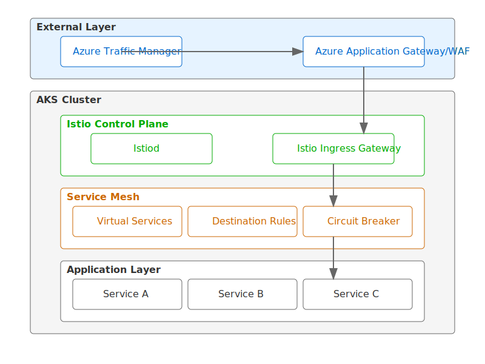

# AKS Business Continuity Management with Istio

This document outlines the design and implementation of Business Continuity Management (BCM) in Azure Kubernetes Service (AKS) using Istio for traffic management, ingress routing, and circuit breaking.

## Architecture Overview



The architecture consists of multiple layers:

1. External Layer
   - Azure Traffic Manager
   - Azure Application Gateway/WAF

2. AKS Cluster
   - Istio Control Plane (Istiod)
   - Istio Ingress Gateway
   - Service Mesh Components
   - Application Layer
   - Monitoring Stack

## Traffic Management Components

### Istio Ingress Gateway
The Istio Ingress Gateway serves as the entry point for external traffic and provides advanced routing capabilities.

### Circuit Breaker Implementation
Circuit breakers are implemented using Istio's DestinationRules and operate in three states:

1. CLOSED (Normal Operation)
   - Regular traffic flow
   - Continuous monitoring of:
     - 5XX errors
     - Connection timeouts
     - HTTP failures
     - Response latency

2. OPEN (Circuit Tripped)
   - Traffic blocked to failing service
   - Fast-fail responses
   - Prevents cascade failures

3. HALF-OPEN (Recovery Testing)
   - Gradual traffic restoration
   - Automatic recovery testing
   - Adaptive behavior

## Implementation Examples

### 1. Basic Service Setup
```yaml
apiVersion: v1
kind: Service
metadata:
  name: my-service
spec:
  ports:
  - port: 8080
    name: http
  selector:
    app: my-service
```

### 2. Circuit Breaker Configuration
```yaml
apiVersion: networking.istio.io/v1alpha3
kind: DestinationRule
metadata:
  name: my-service-circuit-breaker
spec:
  host: my-service
  trafficPolicy:
    connectionPool:
      tcp:
        maxConnections: 100
      http:
        http1MaxPendingRequests: 1
        maxRequestsPerConnection: 1
    outlierDetection:
      consecutive5xxErrors: 5
      interval: 10s
      baseEjectionTime: 30s
      maxEjectionPercent: 100
```

### 3. Virtual Service Configuration
```yaml
apiVersion: networking.istio.io/v1alpha3
kind: VirtualService
metadata:
  name: my-service-routes
spec:
  hosts:
  - my-service
  http:
  - route:
    - destination:
        host: my-service
    timeout: 10s
    retries:
      attempts: 3
      perTryTimeout: 2s
```

## Monitoring and Observability

### Circuit Breaker Monitoring
```bash
# Check circuit breaker status
kubectl get destinationrule my-service-circuit-breaker -o yaml

# Monitor with Istio metrics
istioctl dashboard prometheus

# Useful Prometheus queries
sum(istio_requests_total{destination_service="my-service.default.svc.cluster.local",response_code="503"})
```

### Key Metrics to Monitor
1. Ejection count
2. Recovery time
3. Success rate
4. Latency patterns
5. Connection pool utilization

## Benefits of This Design

1. High Availability
   - Multiple layers of redundancy
   - Automatic failover capabilities
   - Pod anti-affinity rules

2. Resilience
   - Circuit breaking protection
   - Automatic recovery
   - Graceful degradation

3. Observability
   - Comprehensive metrics
   - Real-time monitoring
   - Performance insights

4. Security
   - WAF integration
   - Network policies
   - Traffic encryption

## Best Practices

1. Always implement health checks at multiple levels
2. Use appropriate timeout values for your services
3. Configure reasonable retry policies
4. Monitor circuit breaker states
5. Implement proper logging and tracing
6. Regular testing of failover scenarios

## Additional Resources

- [Istio Documentation](https://istio.io/latest/docs/)
- [AKS Best Practices](https://docs.microsoft.com/en-us/azure/aks/best-practices)
- [Istio Circuit Breaking](https://istio.io/latest/docs/tasks/traffic-management/circuit-breaking/)