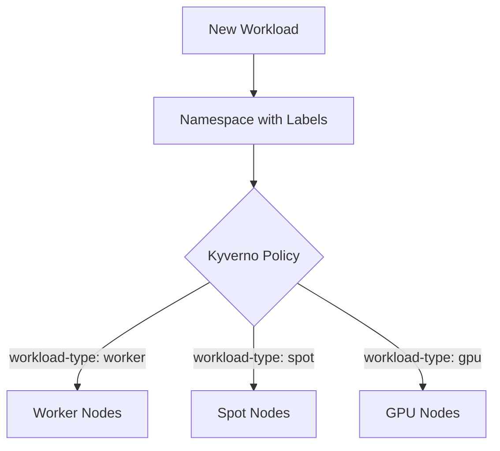
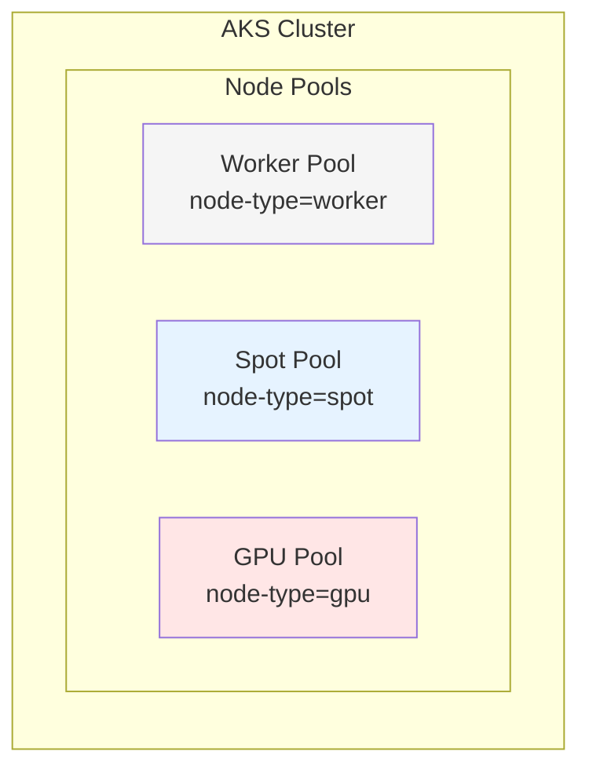
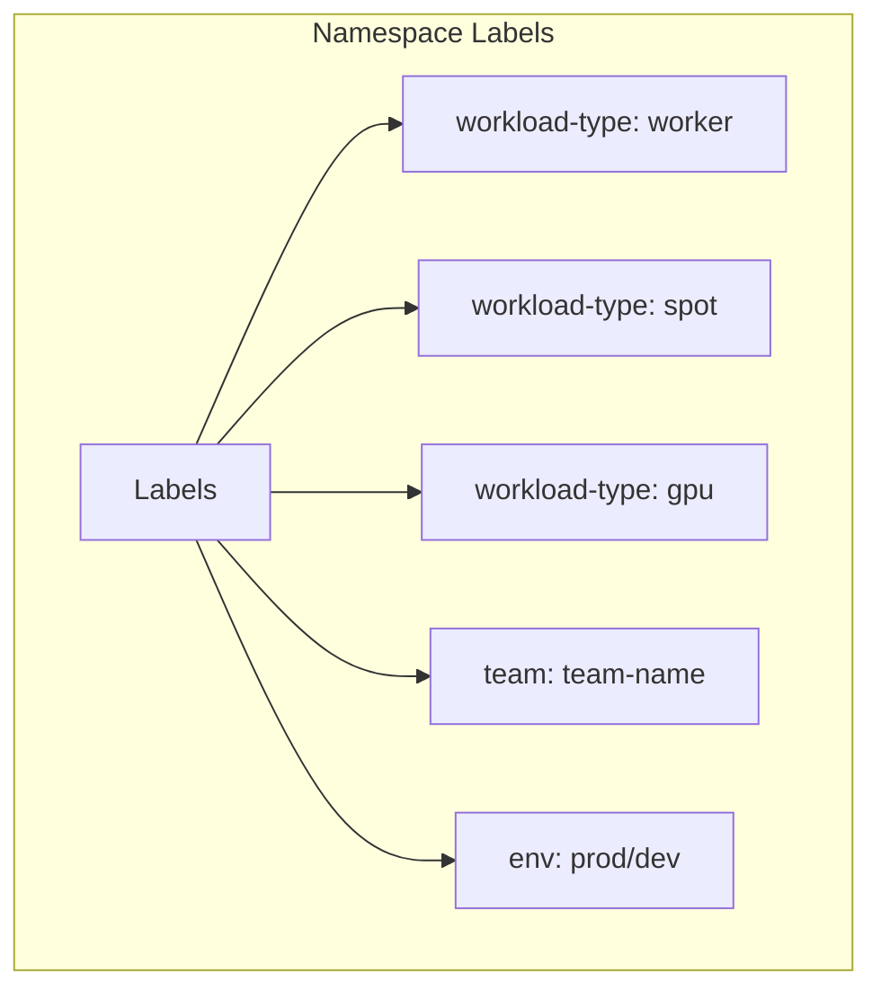
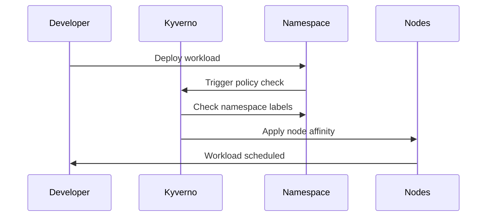

# AKS Workload Placement Strategy
## Overview
This document outlines our strategy for automatic workload placement in AKS using Kyverno policies based on namespace labels.

## Architecture Overview


## Components

### 1. Node Pools
Our AKS cluster consists of three distinct node pools:


### 2. Namespace Labels
Namespaces are labeled to indicate workload requirements:


### 3. Kyverno Policy Flow


## Implementation Steps

### 1. Label Node Pools
```bash
# Label worker nodes
kubectl label nodes <node-name> node-type=worker

# Label spot nodes
kubectl label nodes <node-name> node-type=spot

# Label GPU nodes
kubectl label nodes <node-name> node-type=gpu
```

### 2. Create Namespaces with Labels
```yaml
apiVersion: v1
kind: Namespace
metadata:
  name: team-a-prod
  labels:
    team: team-a
    env: prod
    workload-type: worker
```

### 3. Apply Kyverno Policy
```yaml
apiVersion: kyverno.io/v1
kind: ClusterPolicy
metadata:
  name: add-node-affinity-by-label
spec:
  rules:
  - name: worker-node-affinity
    match:
      resources:
        kinds:
        - Pod
      namespaces:
        selector:
          matchLabels:
            workload-type: worker
    mutate:
      patchStrategicMerge:
        spec:
          affinity:
            nodeAffinity:
              requiredDuringSchedulingIgnoredDuringExecution:
                nodeSelectorTerms:
                - matchExpressions:
                  - key: node-type
                    operator: In
                    values:
                    - worker
```

## Benefits
1. **Flexibility**: Easy to modify placement rules without changing namespace names
2. **Scalability**: Simple to add new node pools and corresponding labels
3. **Maintainability**: Centralized policy management through Kyverno
4. **Automation**: No manual intervention needed for workload placement
5. **Consistency**: Ensures workloads are always scheduled on appropriate nodes

## Best Practices
1. Use consistent label naming conventions
2. Document label meanings and intended use
3. Regularly audit namespace labels
4. Test policies in non-production environment first
5. Monitor Kyverno policy applications through logs

## Monitoring and Verification
- Monitor Kyverno policy applications through logs
- Verify pod placements using:
```bash
kubectl get pods -o wide
kubectl describe pod <pod-name>
```

## Example Deployment
```yaml
apiVersion: apps/v1
kind: Deployment
metadata:
  name: sample-app
  namespace: team-a-prod  # Namespace with workload-type: worker label
spec:
  replicas: 3
  selector:
    matchLabels:
      app: sample-app
  template:
    metadata:
      labels:
        app: sample-app
    spec:
      containers:
      - name: nginx
        image: nginx:latest
```

## Rollout Plan
1. Create and label node pools
2. Apply Kyverno policies
3. Create labeled namespaces
4. Test with sample workload
5. Monitor and verify placement
6. Roll out to teams
