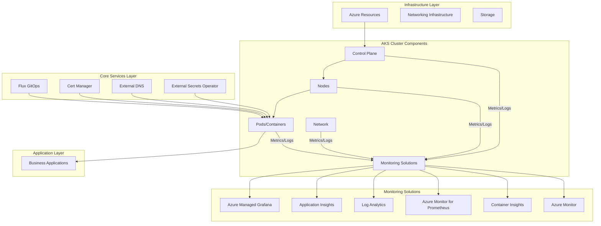

<think>The user wants a comprehensive observability checklist for AKS (Azure Kubernetes Service) clusters. They manage shared Kubernetes clusters for thousands of application teams and need to understand how to observe and alert on actionable activity. They use AKS with Flux GitOps and other AKS features, along with critical core apps like cert-manager, external-dns, and ESO (presumably External Secrets Operator). They want diagrams and checklists to identify gaps in their current observability setup.

Let me organize the key information from the provided documents and form a comprehensive observability checklist:

1. From the monitor-aks.md document:
   - AKS generates platform metrics, Prometheus metrics, activity logs, and resource logs
   - Monitoring tools include Container Insights, Managed Prometheus, Application Insights
   - Viewing metrics in real-time and setting up alerts
   - Node Network Metrics for monitoring network traffic
   
2. From best-practices-monitoring-proactive.md:
   - Need to monitor three main components: cluster infrastructure, application health, and Kubernetes control plane
   - Critical signals for configuring alerts

3. The other documents will likely provide additional details on specific metrics, best practices, and reference information.

I'll create a comprehensive checklist that covers:
1. Monitoring infrastructure (clusters, nodes, etc.)
2. Monitoring applications (pods, containers, etc.)
3. Monitoring the control plane
4. Network observability
5. Cost monitoring
6. Security monitoring
7. Alerting strategies
8. Dashboarding and visualization
9. Log management
10. Special considerations for GitOps and the core apps they use

I'll format this as a Markdown document with diagrams where appropriate, and make sure it's practical for their environment with thousands of app teams.</think># Comprehensive AKS Observability Checklist

## Introduction

This document provides a comprehensive observability framework for managing large-scale AKS deployments with thousands of application teams. It covers monitoring, alerting, and observability strategies across all layers of the Kubernetes stack.

## Observability Architecture Overview

## 1. Cluster Infrastructure Monitoring Checklist

### Node Monitoring
- [ ] **CPU Usage**: Alert when average CPU usage exceeds 80% for extended periods
- [ ] **Memory Usage**: Alert when memory working set exceeds 90%
- [ ] **Disk Space**: Alert when node disk usage exceeds 85%
- [ ] **Node Readiness**: Alert on KubeNodeReadinessFlapping
- [ ] **Node Reachability**: Alert on KubeNodeUnreachable
- [ ] **Node Pool Scaling**: Monitor autoscaling events and capacity
- [ ] **OS Updates**: Monitor node OS patching status

### Storage Monitoring
- [ ] **Persistent Volumes**: Alert on KubePersistentVolumeFillingUp (>85%)
- [ ] **PV Inodes**: Alert on KubePersistentVolumeInodesFillingUp
- [ ] **Storage Errors**: Monitor KubePersistentVolumeErrors
- [ ] **Storage Latency**: Monitor read/write latency on persistent volumes

### Cluster Capacity
- [ ] **Resource Quotas**: Alert on KubeQuotaAlmostFull
- [ ] **CPU Quota**: Alert on KubeCPUQuotaOvercommit
- [ ] **Memory Quota**: Alert on KubeMemoryQuotaOvercommit
- [ ] **Pod Density**: Monitor pod/node ratios
- [ ] **API Request Quota**: Monitor API request limits

## 2. Application Health Monitoring Checklist

### Pod Monitoring
- [ ] **Pod Status**: Alert on pods in CrashLoopBackOff, Error, or Failed states
- [ ] **Pod Restart Count**: Alert on high restart counts
- [ ] **Pod Scheduling**: Alert on pending pods (KubePodNotReadyByController)
- [ ] **Container Restarts**: Alert on KubePodContainerRestart
- [ ] **OOMKilled Events**: Alert on KubeContainerOOMKilled
- [ ] **Resource Usage**: Monitor pods with excessive CPU/memory usage
- [ ] **Pod Lifecycle Events**: Monitor pod creation, deletion, and updates

### Workload Monitoring
- [ ] **Deployment Status**: Alert on KubeDeploymentReplicasMismatch
- [ ] **StatefulSet Status**: Alert on KubeStatefulSetReplicasMismatch
- [ ] **DaemonSet Status**: Alert on KubeDaemonSetNotScheduled/MisScheduled
- [ ] **HPA Status**: Alert on KubeHpaReplicasMismatch and KubeHpaMaxedOut
- [ ] **Job Status**: Alert on KubeJobFailed and KubeJobStale
- [ ] **Service Endpoints**: Monitor service endpoint availability

### Application Performance
- [ ] **Response Time**: Monitor application latency/response times
- [ ] **Error Rates**: Monitor application error rates
- [ ] **Request Rates**: Monitor application throughput
- [ ] **Success Rate**: Monitor percentage of successful requests
- [ ] **Container CPU/Memory**: Alert on KubeContainerAverageCPUHigh/KubeContainerAverageMemoryHigh
- [ ] **Application-specific metrics**: Identify and monitor key business metrics

## 3. Kubernetes Control Plane Monitoring Checklist

### API Server Monitoring
- [ ] **API Server Availability**: Monitor API server uptime
- [ ] **API Request Latency**: Alert on high API request latency
- [ ] **API Server Error Rate**: Alert on API server errors
- [ ] **API Request Rate**: Monitor request rates by verb and resource
- [ ] **API Client Errors**: Alert on KubeClientErrors
- [ ] **Webhook Latency**: Monitor admission webhook latency

### Scheduler Monitoring
- [ ] **Scheduling Latency**: Monitor pod scheduling latency
- [ ] **Scheduling Failures**: Alert on scheduling failures
- [ ] **Pod Startup Latency**: Alert on KubeletPodStartUpLatencyHigh

### Controller Manager
- [ ] **Controller Loop Duration**: Monitor controller manager loop execution time
- [ ] **Work Queue Depth**: Monitor controller queue depths
- [ ] **Reconciliation Rate**: Monitor resource reconciliation rates

### etcd Monitoring
- [ ] **etcd Latency**: Monitor etcd read/write latency
- [ ] **etcd DB Size**: Alert when etcd database size exceeds thresholds
- [ ] **etcd Leader Changes**: Alert on frequent etcd leader elections
- [ ] **etcd Backup Status**: Verify etcd backup completion status

## 4. Network Observability Checklist

### Ingress/Egress Traffic
- [ ] **Network Throughput**: Monitor bytes in/out per node
- [ ] **Connection Count**: Monitor active connections per node
- [ ] **Dropped Packets**: Alert on high packet drop rates (cilium_drop_count_total)
- [ ] **Forwarded Packets**: Monitor forwarded packets (cilium_forward_count_total)
- [ ] **TCP State**: Monitor TCP socket states (networkobservability_tcp_state)
- [ ] **DNS Resolution**: Monitor DNS query latency and failures

### Network Policies
- [ ] **Network Policy Drops**: Monitor dropped connections due to network policies
- [ ] **Network Policy Coverage**: Ensure all namespaces have network policies

### Service Mesh 
- [ ] **Mesh Traffic**: Monitor service-to-service communication
- [ ] **Mesh Latency**: Monitor service mesh request latency
- [ ] **Mesh Error Rate**: Monitor service mesh request errors

## 5. GitOps and Core Services Monitoring Checklist

### Flux GitOps
- [ ] **Reconciliation Status**: Monitor Flux reconciliation success/failures
- [ ] **Git Repository Status**: Alert on repository connectivity issues
- [ ] **Sync Status**: Monitor drift between GitOps desired state and cluster state
- [ ] **Event Log**: Monitor Flux controller event logs

### Cert Manager
- [ ] **Certificate Expiration**: Alert on certificates nearing expiration (30 days)
- [ ] **Certificate Issuance Errors**: Alert on certificate issuance failures
- [ ] **Certificate Renewal Rate**: Monitor certificate renewal attempts
- [ ] **ACME Challenges**: Monitor ACME challenge success/failure rates

### External DNS
- [ ] **DNS Record Sync Status**: Monitor DNS record synchronization status
- [ ] **DNS Provider Errors**: Alert on DNS provider API errors
- [ ] **Record Update Latency**: Monitor time from change to DNS propagation

### External Secrets Operator
- [ ] **Secret Sync Status**: Monitor secret synchronization status
- [ ] **Secret Provider Errors**: Alert on secret provider connectivity issues
- [ ] **Secret Rotation**: Monitor secret rotation events
- [ ] **Secret Access**: Monitor secret access patterns

### Kyverno
- [ ] **Policy Sync Status**: Monitor policy deployment and synchronization
- [ ] **Policy Violations**: Alert on critical policy violations
- [ ] **Policy Enforcement Mode**: Monitor audit vs enforce modes
- [ ] **Admission Review Latency**: Monitor impact on admission request performance
- [ ] **Policy Mutation Success/Failures**: Track success rates of resource mutations
- [ ] **Kyverno Resource Usage**: Monitor Kyverno controller CPU/memory usage
- [ ] **Webhook Connection Issues**: Alert on webhook connectivity problems
- [ ] **Background Scan Status**: Monitor status of background policy validations

### ServiceNow Informer
- [ ] **Integration Status**: Monitor connection status with ServiceNow instance
- [ ] **Event Processing Rate**: Track volume of events being processed
- [ ] **Synchronization Errors**: Alert on failures to create/update ServiceNow records
- [ ] **Latency**: Monitor time between Kubernetes events and ServiceNow updates
- [ ] **API Rate Limiting**: Monitor ServiceNow API quota usage
- [ ] **Missing Configuration Items**: Alert on Kubernetes resources missing in ServiceNow CMDB
- [ ] **Authentication Errors**: Monitor ServiceNow authentication failures
- [ ] **Queue Depth**: Alert on growing backlog of unprocessed events

## 6. Security Monitoring Checklist

### Container Security
- [ ] **Vulnerable Images**: Scan for and alert on container vulnerabilities
- [ ] **Privilege Escalation**: Alert on containers running with elevated privileges
- [ ] **Resource Limits**: Ensure all containers have resource limits defined
- [ ] **Mounted Sensitive Volumes**: Alert on containers with sensitive host mounts

### Access Control
- [ ] **RBAC Changes**: Monitor changes to RBAC configurations
- [ ] **Service Account Token Usage**: Monitor service account token usage
- [ ] **Unauthorized API Calls**: Alert on unauthorized API requests
- [ ] **Privileged Operations**: Monitor kubectl exec/cp/port-forward operations

### Compliance
- [ ] **AKS CIS Benchmark**: Regular CIS benchmark assessment
- [ ] **Pod Security Standards**: Monitor violations of pod security standards
- [ ] **Network Policy Enforcement**: Verify network policy enforcement

## 7. Cost Monitoring Checklist

- [ ] **Node Utilization**: Monitor node resource utilization efficiency
- [ ] **Idle Resources**: Identify and alert on underutilized resources
- [ ] **Resource Requests vs. Usage**: Monitor over-provisioned workloads
- [ ] **Namespace Cost Attribution**: Track costs by namespace/team
- [ ] **PV Storage Costs**: Monitor persistent volume storage costs
- [ ] **Egress Traffic Costs**: Monitor network egress costs

## 8. Observability Implementation Checklist

### Core Monitoring Tools
- [ ] **Azure Monitor**: Enable enhanced metrics collection
- [ ] **Container Insights**: Enable with Live Data Mode
- [ ] **Azure Monitor for Prometheus**: Enable metric collection with recommended alert rules
- [ ] **Log Analytics**: Configure appropriate retention and ingestion rates
- [ ] **Application Insights**: Enable for application performance monitoring
- [ ] **Azure Managed Grafana**: Configure with pre-built dashboards

### Key Dashboards to Create
- [ ] **Cluster Overview**: Node status, resource usage, pod count
- [ ] **Application Health**: Deployment status, error rates, latency
- [ ] **Network Traffic**: Ingress/egress, pod-to-pod communication
- [ ] **Control Plane Health**: API server, scheduler, etcd metrics
- [ ] **Cost Analysis**: Resource utilization, efficiency metrics
- [ ] **Security Posture**: Vulnerability scan results, compliance metrics
- [ ] **GitOps Status**: Reconciliation status, event logs
- [ ] **Core Services**: Status of cert-manager, external-dns, ESO

### Alert Configuration
- [ ] **Severity Levels**: Define clear severity levels (P1-P5)
- [ ] **Alert Routing**: Configure appropriate alert routing by severity/component
- [ ] **Alert Grouping**: Group related alerts to reduce noise
- [ ] **Actionable Alerts**: Ensure alerts provide clear remediation steps
- [ ] **SLO/SLA Alerts**: Configure alerts based on service level objectives

## 9. Multi-Tenant Considerations for Shared Clusters

### Namespace-level Monitoring
- [ ] **Namespace Resource Quotas**: Monitor namespace quota utilization
- [ ] **Tenant Isolation**: Monitor cross-namespace access attempts
- [ ] **Tenant Resource Usage**: Track resources by tenant/application team

### Multi-team Access
- [ ] **Team-specific Dashboards**: Create team-specific monitoring views
- [ ] **Filtered Alerts**: Route alerts to appropriate application teams
- [ ] **Self-service Monitoring**: Enable teams to create custom dashboards

## Recommended Alert Thresholds

| Component | Metric | Warning Threshold | Critical Threshold |
|-----------|--------|-------------------|-------------------|
| Node | CPU Usage | >80% for 15 min | >90% for 5 min |
| Node | Memory Usage | >85% for 15 min | >90% for 5 min |
| Node | Disk Space | >85% | >90% |
| Pod | Restart Count | >5 in 1 hour | >10 in 1 hour |
| Pod | OOMKilled | >0 in 1 hour | >3 in 1 hour |
| API Server | Latency | >500ms p99 | >1s p99 |
| API Server | Error Rate | >5% | >10% |
| etcd | Leader Changes | >3 in 1 hour | >5 in 1 hour |
| Certificate | Days to Expiry | <30 days | <7 days |
| Flux | Reconciliation Failure | >3 consecutive | >10 consecutive |

## Implementation Roadmap

1. **Phase 1: Core Infrastructure Monitoring**
   - Set up Azure Monitor and Container Insights
   - Enable Azure Monitor for Prometheus
   - Configure essential node and control plane alerts

2. **Phase 2: Application Monitoring**
   - Implement pod and workload monitoring
   - Configure Application Insights for key applications
   - Set up application performance dashboards

3. **Phase 3: Advanced Observability**
   - Implement network observability
   - Enable GitOps and core services monitoring
   - Set up cost monitoring

4. **Phase 4: Security and Compliance**
   - Implement security monitoring
   - Configure compliance checks
   - Set up tenant isolation monitoring

5. **Phase 5: Self-service and Team Empowerment**
   - Create team-specific dashboards
   - Enable self-service monitoring
   - Implement automated remediation where possible

## References

- [Azure Kubernetes Service Monitoring](https://github.com/MicrosoftDocs/azure-aks-docs/blob/main/articles/aks/monitor-aks.md)
- [Proactive Monitoring Best Practices for AKS](https://github.com/MicrosoftDocs/azure-aks-docs/blob/main/articles/aks/best-practices-monitoring-proactive.md)
- [AKS Monitoring Reference](https://github.com/MicrosoftDocs/azure-aks-docs/blob/main/articles/aks/monitor-aks-reference.md)
- [Container Network Observability Concepts](https://github.com/MicrosoftDocs/azure-aks-docs/blob/main/articles/aks/container-network-observability-concepts.md)
